# System Architecture Analysis
<!-- generated in 0.00s -->

## Overview

- **Project**: /home/tom/github/if-uri/urirun-contract
- **Primary Language**: python
- **Languages**: python: 21, yaml: 4, shell: 4, yml: 3, json: 3
- **Analysis Mode**: static
- **Total Functions**: 104
- **Total Classes**: 10
- **Modules**: 43
- **Entry Points**: 47

## Architecture by Module

### toolkit.contract_gate
- **Functions**: 19
- **Classes**: 3
- **File**: `contract_gate.py`

### urirun_contract.gate
- **Functions**: 19
- **Classes**: 3
- **File**: `gate.py`

### urirun_contract.codegen
- **Functions**: 12
- **File**: `codegen.py`

### packages.consumer-go.service
- **Functions**: 7
- **File**: `service.go`

### packages.consumer.service
- **Functions**: 5
- **Classes**: 1
- **File**: `service.py`

### TODO.consumer_service
- **Functions**: 5
- **Classes**: 1
- **File**: `consumer_service.py`

### orchestrator.drive
- **Functions**: 4
- **File**: `drive.py`

### ci.nl_to_contract
- **Functions**: 4
- **File**: `nl_to_contract.py`

### TODO.nl_to_contract
- **Functions**: 4
- **File**: `nl_to_contract.py`

### packages.producer.service
- **Functions**: 4
- **Classes**: 1
- **File**: `service.py`

### xlang.peer
- **Functions**: 4
- **File**: `peer.py`

### TODO.producer_service
- **Functions**: 4
- **Classes**: 1
- **File**: `producer_service.py`

### TODO.orchestrator_drive
- **Functions**: 3
- **File**: `orchestrator_drive.py`

### examples.windowpair.src.handlers_generated
- **Functions**: 2
- **File**: `handlers_generated.py`

### TODO.handlers_generated
- **Functions**: 2
- **File**: `handlers_generated.py`

### TODO.emit_handlers
- **Functions**: 2
- **File**: `emit_handlers.py`

### toolkit.contracts_io
- **Functions**: 1
- **File**: `contracts_io.py`

### ci.emit_handlers
- **Functions**: 1
- **File**: `emit_handlers.py`

### TODO.contracts_io
- **Functions**: 1
- **File**: `contracts_io.py`

### ci.regen_check
- **Functions**: 1
- **File**: `regen_check.py`

## Key Entry Points

Main execution flows into the system:

### xlang.peer.main
- **Calls**: SystemExit, None.items, json.dump, json.load, xlang.peer._find_wire, toolkit.contract_gate.wire_payload, toolkit.contract_gate.consumer_input_check, json.dump

### urirun_contract.codegen.js_stub
> Generate a JS handler skeleton.
- **Calls**: urirun_contract.codegen._inp, None.join, urirun_contract.codegen._out, None.join, getattr, isinstance, isinstance, urirun_contract.codegen._base

### ci.nl_to_contract.main
- **Calls**: os.path.dirname, os.path.dirname, os.path.join, ci.nl_to_contract.validate_doc, os.path.abspath, json.load, print, print

### TODO.nl_to_contract.main
- **Calls**: os.path.dirname, os.path.join, TODO.nl_to_contract.validate_doc, os.path.abspath, json.load, print, print, json.dump

### packages.producer.service.Handler.do_POST
- **Calls**: self.rfile.read, json.loads, packages.producer.service.close_handler, self.send_response, self.send_header, self.end_headers, self.wfile.write, int

### TODO.producer_service.Handler.do_POST
- **Calls**: self.rfile.read, json.loads, packages.producer.service.close_handler, self.send_response, self.send_header, self.end_headers, self.wfile.write, int

### urirun_contract.gate.consumer_input_check
> Validate the payload built from a wire edge. Returns (mode, problems).

mode='full'    — the wire covers every required consumer input: full handoff.

- **Calls**: set, sorted, set, inp.get, inp.items, set, problems.append, urirun_contract.gate.check

### packages.consumer.service.Handler.do_POST
- **Calls**: self.rfile.read, json.loads, packages.consumer.service.restore_handler, self.send_response, self.send_header, self.end_headers, self.wfile.write, int

### TODO.consumer_service.Handler.do_POST
- **Calls**: self.rfile.read, json.loads, packages.consumer.service.restore_handler, self.send_response, self.send_header, self.end_headers, self.wfile.write, int

### ci.emit_handlers.main
- **Calls**: urirun_contract.codegen._load_contracts_json, urirun_contract.codegen.emit_py_module, os.path.join, os.path.join, os.path.exists, print, sys.stdout.write, os.makedirs

### ci.regen_check.main
- **Calls**: urirun_contract.codegen._load_contracts_json, urirun_contract.codegen.emit_py_module, None.read, print, os.path.join, os.path.join, os.path.exists, print

### TODO.orchestrator_drive.main
- **Calls**: TODO.orchestrator_drive.wait_ready, TODO.orchestrator_drive.wait_ready, TODO.orchestrator_drive.post, toolkit.contract_gate.check, toolkit.contract_gate.find_wire, toolkit.contract_gate.wire_payload, toolkit.contract_gate.consumer_input_check, TODO.orchestrator_drive.post

### toolkit.contract_gate.enforce
> Wrap ``conn.handler`` so each decorated handler is guarded by its contract.

Must be called BEFORE any ``@conn.handler`` decorator. Usage::

    conn 
- **Calls**: object.__setattr__, base_handler, contracts.get, functools.wraps, deco, hasattr, conn.attach_contract, deco

### urirun_contract.gate.enforce
> Wrap ``conn.handler`` so each decorated handler is guarded by its contract.

Must be called BEFORE any ``@conn.handler`` decorator. Usage::

    conn 
- **Calls**: object.__setattr__, base_handler, contracts.get, functools.wraps, deco, hasattr, conn.attach_contract, deco

### urirun_contract.codegen.go_stub
> Generate a Go handler skeleton.
- **Calls**: urirun_contract.codegen._inp, None.join, getattr, None.title, urirun_contract.codegen._base, None.get, urirun_contract.codegen._camel, inp.items

### toolkit.contract_gate.check_wire
> Statically validate a composition edge. Returns a list of problems ([] = clean).

Catches: missing field, type mismatch, conditional→required binding 
- **Calls**: wire.mapping.items, cons.inp.get, problems.append, isinstance, c_sub.startswith, toolkit.contract_gate.resolve_out_type, problems.append, toolkit.contract_gate.assignable

### urirun_contract.gate.check_wire
> Statically validate a composition edge. Returns a list of problems ([] = clean).

Catches: missing field, type mismatch, conditional→required binding 
- **Calls**: wire.mapping.items, cons.inp.get, problems.append, isinstance, c_sub.startswith, urirun_contract.gate.resolve_out_type, problems.append, urirun_contract.gate.assignable

### packages.consumer-go.service.main
- **Calls**: packages.consumer-go.service.loadContracts, packages.consumer-go.service.Getenv, packages.consumer-go.service.NewServeMux, packages.consumer-go.service.HandleFunc, packages.consumer-go.service.func, packages.consumer-go.service.writeJSON, packages.consumer-go.service.Printf, packages.consumer-go.service.ListenAndServe

### toolkit.contract_gate.conform
> The CI oracle. Raises AssertionError on the first violation; returns None when all pass.
- **Calls**: contracts.items, enumerate, toolkit.contract_gate.check, toolkit.contract_gate.check, enumerate, ex.get, ex.get, None.get

### urirun_contract.gate.conform
> The CI oracle. Raises AssertionError on the first violation; returns None when all pass.
- **Calls**: contracts.items, enumerate, urirun_contract.gate.check, urirun_contract.gate.check, enumerate, ex.get, ex.get, None.get

### toolkit.contracts_io.load
- **Calls**: json.load, os.environ.get, open, SimpleNamespace, SimpleNamespace, None.items, doc.get, c.get

### TODO.contracts_io.load
- **Calls**: json.load, os.environ.get, open, SimpleNamespace, SimpleNamespace, None.items, doc.get, c.get

### toolkit.contract_gate.attach_contracts
> Join contracts onto live urirun bindings BY ROUTE KEY.

Requires ``urirun`` to be installed. Safe to call when absent — returns ``conn`` unchanged.
- **Calls**: None.get, contracts.items, store.get, decorated_bindings, conn.uri, toolkit.contract_gate.contract_to_dict, binding.setdefault

### urirun_contract.gate.attach_contracts
> Join contracts onto live urirun bindings BY ROUTE KEY.

Requires ``urirun`` to be installed. Safe to call when absent — returns ``conn`` unchanged.
- **Calls**: None.get, contracts.items, store.get, decorated_bindings, conn.uri, urirun_contract.gate.contract_to_dict, binding.setdefault

### packages.consumer-go.service.handleRun
- **Calls**: packages.consumer-go.service.NewDecoder, packages.consumer-go.service.Decode, packages.consumer-go.service.checkSchema, packages.consumer-go.service.writeJSON, packages.consumer-go.service.Sprintf, packages.consumer-go.service.restoreHandler

### orchestrator.drive.main
- **Calls**: orchestrator.drive.wait_ready, orchestrator.drive.wait_ready, orchestrator.drive._run_pair, orchestrator.drive.wait_ready, orchestrator.drive._run_pair, print

### packages.consumer.service.Handler._err
- **Calls**: self.send_response, self.send_header, self.end_headers, self.wfile.write, None.encode, json.dumps

### TODO.consumer_service.Handler._err
- **Calls**: self.send_response, self.send_header, self.end_headers, self.wfile.write, None.encode, json.dumps

### TODO.emit_handlers.emit
- **Calls**: TODO.emit_handlers.load_contracts, cg.py_stub, sorted, None.join

### packages.consumer.service.Handler.do_GET
- **Calls**: self.send_response, self.send_header, self.end_headers, self.wfile.write

## Process Flows

Key execution flows identified:

### Flow 1: main
```
main [xlang.peer]
  └─> _find_wire
```

### Flow 2: js_stub
```
js_stub [urirun_contract.codegen]
  └─> _inp
  └─> _out
```

### Flow 3: do_POST
```
do_POST [packages.producer.service.Handler]
  └─ →> close_handler
```

### Flow 4: consumer_input_check
```
consumer_input_check [urirun_contract.gate]
```

### Flow 5: enforce
```
enforce [toolkit.contract_gate]
```

### Flow 6: go_stub
```
go_stub [urirun_contract.codegen]
  └─> _inp
  └─> _base
```

### Flow 7: check_wire
```
check_wire [toolkit.contract_gate]
```

### Flow 8: conform
```
conform [toolkit.contract_gate]
  └─> check
      └─> _leaf_ok
  └─> check
      └─> _leaf_ok
```

## Key Classes

### packages.consumer.service.Handler
- **Methods**: 4
- **Key Methods**: packages.consumer.service.Handler.log_message, packages.consumer.service.Handler._err, packages.consumer.service.Handler.do_GET, packages.consumer.service.Handler.do_POST
- **Inherits**: BaseHTTPRequestHandler

### TODO.consumer_service.Handler
- **Methods**: 4
- **Key Methods**: TODO.consumer_service.Handler.log_message, TODO.consumer_service.Handler._err, TODO.consumer_service.Handler.do_GET, TODO.consumer_service.Handler.do_POST
- **Inherits**: BaseHTTPRequestHandler

### packages.producer.service.Handler
- **Methods**: 3
- **Key Methods**: packages.producer.service.Handler.log_message, packages.producer.service.Handler.do_GET, packages.producer.service.Handler.do_POST
- **Inherits**: BaseHTTPRequestHandler

### TODO.producer_service.Handler
- **Methods**: 3
- **Key Methods**: TODO.producer_service.Handler.log_message, TODO.producer_service.Handler.do_GET, TODO.producer_service.Handler.do_POST
- **Inherits**: BaseHTTPRequestHandler

### toolkit.contract_gate.Contract
> One route's canonical contract. The URI path is the stable identity; this is its versioned axis.
- **Methods**: 0

### toolkit.contract_gate.Wire
> A composition edge: the output of ``producer`` feeds the input of ``consumer``.

``mapping``: {consu
- **Methods**: 0

### toolkit.contract_gate.ContractViolation
> Handler output diverged from its declared contract.
- **Methods**: 0
- **Inherits**: AssertionError

### urirun_contract.gate.Contract
> One route's canonical contract. The URI path is the stable identity; this is its versioned axis.
- **Methods**: 0

### urirun_contract.gate.Wire
> A composition edge: the output of ``producer`` feeds the input of ``consumer``.

``mapping``: {consu
- **Methods**: 0

### urirun_contract.gate.ContractViolation
> Handler output diverged from its declared contract.
- **Methods**: 0
- **Inherits**: AssertionError

## Data Transformation Functions

Key functions that process and transform data:

### ci.nl_to_contract.validate_doc
> Brama: ta sama logika co conform() ale na surowym JSON-ie z LLM.
- **Output to**: doc.get, C.items, c.get, enumerate, problems.append

### TODO.nl_to_contract.validate_doc
> Brama: ta sama logika konformansu co reszta systemu, na surowym dokumencie z LLM.
- **Output to**: doc.get, C.items, c.get, enumerate, problems.append

### toolkit.contract_gate._parse_const
- **Output to**: None.isdigit, int, token.lstrip

### toolkit.contract_gate.validate_output
> Validate an ok-envelope against the contract's ``out`` (no-op when out is empty).
- **Output to**: toolkit.contract_gate.check

### urirun_contract.gate._parse_const
- **Output to**: None.isdigit, int, token.lstrip

### urirun_contract.gate.validate_output
> Validate an ok-envelope against the contract's ``out`` (no-op when out is empty).
- **Output to**: urirun_contract.gate.check

## Behavioral Patterns

### recursion__py_value
- **Type**: recursion
- **Confidence**: 0.90
- **Functions**: urirun_contract.codegen._py_value

### recursion__leaf_ok
- **Type**: recursion
- **Confidence**: 0.90
- **Functions**: toolkit.contract_gate._leaf_ok

### recursion_check
- **Type**: recursion
- **Confidence**: 0.90
- **Functions**: toolkit.contract_gate.check

### recursion__walk_out
- **Type**: recursion
- **Confidence**: 0.90
- **Functions**: toolkit.contract_gate._walk_out

### recursion__leaf_ok
- **Type**: recursion
- **Confidence**: 0.90
- **Functions**: urirun_contract.gate._leaf_ok

### recursion_check
- **Type**: recursion
- **Confidence**: 0.90
- **Functions**: urirun_contract.gate.check

### recursion__walk_out
- **Type**: recursion
- **Confidence**: 0.90
- **Functions**: urirun_contract.gate._walk_out

## Public API Surface

Functions exposed as public API (no underscore prefix):

- `xlang.peer.main` - 52 calls
- `urirun_contract.codegen.js_stub` - 26 calls
- `ci.nl_to_contract.main` - 24 calls
- `ci.nl_to_contract.validate_doc` - 23 calls
- `TODO.nl_to_contract.validate_doc` - 19 calls
- `TODO.nl_to_contract.main` - 19 calls
- `toolkit.contract_gate.check` - 19 calls
- `urirun_contract.gate.check` - 19 calls
- `packages.producer.service.Handler.do_POST` - 19 calls
- `TODO.producer_service.Handler.do_POST` - 19 calls
- `toolkit.contract_gate.consumer_input_check` - 18 calls
- `urirun_contract.gate.consumer_input_check` - 18 calls
- `packages.consumer.service.Handler.do_POST` - 18 calls
- `TODO.consumer_service.Handler.do_POST` - 18 calls
- `urirun_contract.codegen.py_stub` - 17 calls
- `ci.emit_handlers.main` - 16 calls
- `ci.regen_check.main` - 15 calls
- `TODO.orchestrator_drive.main` - 14 calls
- `toolkit.contract_gate.enforce` - 12 calls
- `urirun_contract.gate.enforce` - 12 calls
- `urirun_contract.codegen.go_stub` - 11 calls
- `toolkit.contract_gate.check_wire` - 11 calls
- `urirun_contract.gate.check_wire` - 11 calls
- `packages.consumer-go.service.main` - 10 calls
- `toolkit.contract_gate.conform` - 10 calls
- `toolkit.contract_gate.envelope_violation` - 10 calls
- `urirun_contract.gate.conform` - 10 calls
- `urirun_contract.gate.envelope_violation` - 10 calls
- `packages.consumer-go.service.loadContracts` - 9 calls
- `ci.nl_to_contract.ask_llm` - 9 calls
- `packages.consumer-go.service.checkSchema` - 8 calls
- `toolkit.contracts_io.load` - 8 calls
- `TODO.nl_to_contract.ask_llm` - 8 calls
- `TODO.contracts_io.load` - 8 calls
- `toolkit.contract_gate.attach_contracts` - 7 calls
- `urirun_contract.gate.attach_contracts` - 7 calls
- `packages.consumer-go.service.handleRun` - 6 calls
- `TODO.orchestrator_drive.post` - 6 calls
- `orchestrator.drive.post` - 6 calls
- `orchestrator.drive.main` - 6 calls

## System Interactions

How components interact:

```mermaid
graph TD
    main --> SystemExit
    main --> items
    main --> dump
    main --> load
    main --> _find_wire
    js_stub --> _inp
    js_stub --> join
    js_stub --> _out
    js_stub --> getattr
    main --> dirname
    main --> join
    main --> validate_doc
    main --> abspath
    do_POST --> read
    do_POST --> loads
    do_POST --> close_handler
    do_POST --> send_response
    do_POST --> send_header
    consumer_input_check --> set
    consumer_input_check --> sorted
    consumer_input_check --> get
    consumer_input_check --> items
    do_POST --> restore_handler
    main --> _load_contracts_json
    main --> emit_py_module
    main --> exists
    main --> read
    main --> print
    main --> wait_ready
    main --> post
```



## Reverse Engineering Guidelines

1. **Entry Points**: Start analysis from the entry points listed above
2. **Core Logic**: Focus on classes with many methods
3. **Data Flow**: Follow data transformation functions
4. **Process Flows**: Use the flow diagrams for execution paths
5. **API Surface**: Public API functions reveal the interface

## Context for LLM

Maintain the identified architectural patterns and public API surface when suggesting changes.